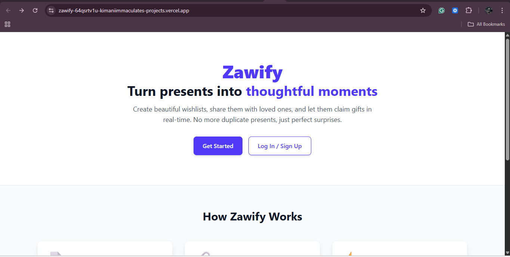
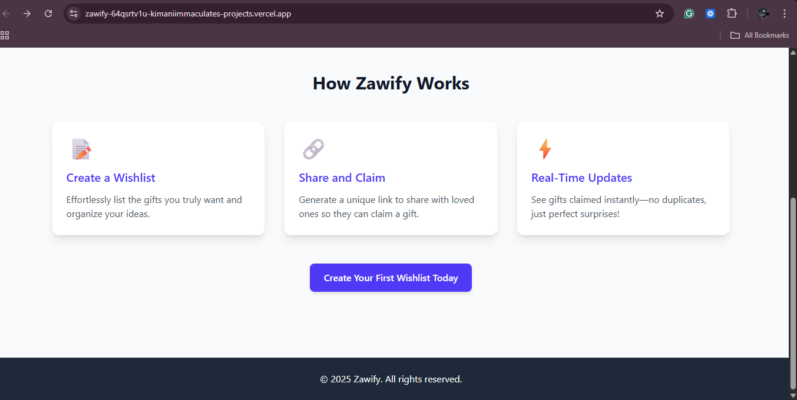
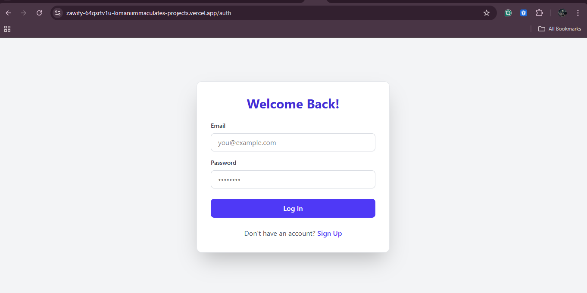

# Zawify. (A Real‑Time Wishlist App)


Zawify is a real‑time gift‑claiming application built with the MERN stack (MongoDB Atlas, Express, React + Vite, Node.js) and Socket.IO. Users create shareable wishlists and friends/family can claim gifts in real time while preventing duplicate claims.


## Live demo
- Frontend: https://zawify.vercel.app/  
- Backend API: https://zawify-2.onrender.com/
- Canva Slides: https://www.canva.com/design/DAGxe7b4Ov8/zcrxquyIrd-TmFCuifaDcQ/edit?utm_content=DAGxe7b4Ov8&utm_campaign=designshare&utm_medium=link2&utm_source=sharebutton

## Table of contents
- [Overview](#overview)  
- [Features](#features)  
- [Architecture & stack](#architecture--stack)  
- [Project structure](#project-structure)  
- [Quick start (local development)](#quick-start-local-development)  
- [Environment variables](#environment-variables)  
- [API reference (examples)](#api-reference-examples) 
- [Screenshots](#screenshots)  
- [Deployment notes](#deployment-notes)  


## Overview
Owners create wishlists and add items. Each wishlist can be published via a public link. Visitors open the public link and claim items; claims are processed by the server and broadcast via Socket.IO so all connected clients see updates instantly. JWT-based auth protects create/edit/claim operations.


## Features
- User registration & JWT authentication
- Create, edit, delete wishlists and items
- Publish wishlists via public URL
- Real‑time gift claiming using Socket.IO, preventing duplicate claims
- REST API for programmatic access
- Minimal admin endpoints (extendable)


## Architecture & stack
- Frontend: React + Vite, optional Tailwind, axios, socket.io-client  
- Backend: Node.js, Express, Socket.IO, Mongoose (MongoDB Atlas)  
- Auth: JSON Web Tokens (JWT)  
- Realtime: Socket.IO rooms per wishlist


## Project structure
Monorepo layout:

```
Zawify/                         
├── .github/
│   └── workflows/
│       └── ci.yml               # GitHub Actions — ALL GREEN on every push
├── .gitignore
├── README.md                    
│
├── frontend/
│   ├── src/
│   │   ├── pages/               
│   │   │   ├── LandingPage.jsx
│   │   │   ├── AuthForm.jsx
│   │   │   ├── CreateWishlist.jsx
│   │   │   └── WishlistDetail.jsx
│   │   ├── utils/
│   │   │   └── socket.js        # Socket.IO client
│   │   ├── App.jsx
│   │   ├── main.jsx
│   │   ├── index.css
│   │   └── __tests__/
│   │       ├── AuthForm.test.jsx
│   │       ├── LandingPage.test.jsx
│   │       ├── CreateWishlist.test.jsx
│   │       └── WishlistDetail.test.jsx   # 15+ tests — ALL GREEN
│   ├── index.html                   
│   ├── .env                         
│   ├── package.json
│   ├── vite.config.js
│   └── vitest.config.js (or vite.config.js handles testing)
│
└── backend/
    ├── .env                         # MONGO_URI, JWT_SECRET, CLIENT_URL
    ├── server.js                    # Final version — only starts when run directly
    ├── jest.config.js               # ESM + Jest — working perfectly
    ├── package.json
    │
    └── src/
        ├── config/
        │   └── db.js                # connectDB() function only
        ├── controllers/
        │   └── authController.js    # (or logic inline in routes)
        ├── middleware/
        │   └── auth.js              # JWT — passes id + name
        ├── models/
        │   ├── User.js
        │   └── Wishlist.js
        ├── routes/
        │   ├── auth.js
        │   └── wishlist.js          # /create, /:id, /claim
        └── __tests__/
            └── wishlist.test.js     # Real JWT, real DB — 3/3 PASSING

```


## Quick start (local development)

Prereqs:
- Node.js v18+
- MongoDB Atlas connection string
- Git

1. Clone
```bash
git clone <repo-url>
cd Zawify
```

2. Backend
```bash
cd backend
npm install
# create .env (see example below)
npm run server   # or `npm run dev` depending on package.json
```

3. Frontend
```bash
cd ../frontend
npm install
# optionally set VITE_API_URL=http://localhost:5000 in frontend/.env
npm run dev
# open http://localhost:5173
```

---

## Environment variables

Backend `backend/.env` (example)
```
MONGO_URI="mongodb+srv://<user>:<pass>@<cluster>.mongodb.net/zawify?retryWrites=true&w=majority"
JWT_SECRET="a_strong_jwt_secret"
PORT=5000
FRONTEND_ORIGIN="http://localhost:5173"
```

Frontend `frontend/.env` (example)
```
VITE_API_URL="http://localhost:5000"
```


## API reference (examples)
All endpoints are mounted under `/api`.

Auth
- POST /api/auth/register  
  Body: `{ "name", "email", "password" }`  
  Response: `{ token, user }`

- POST /api/auth/login  
  Body: `{ "email", "password" }`  
  Response: `{ token, user }`

Wishlists
- POST /api/wishlists (auth) — create wishlist. Body: `{ title, description?, isPublic? }`  
- GET /api/wishlists/:id — get wishlist details  
- GET /api/wishlists/public/:id — public view (no auth)  
- POST /api/wishlists/:id/claim (auth) — claim an item. Body: `{ itemId }`  
  Response: `{ success: true, itemId, claimedBy }` and emits `gift:claimed` to `wishlist:<id>`

## Screenshots

 

 

 


## Deployment notes
Frontend
- Build the Vite app and deploy to Vercel/Netlify. Set `VITE_API_URL` to the backend URL.

Backend
- Deploy to Render/Heroku/Railway. Set `MONGO_URI`, `JWT_SECRET`, `FRONTEND_ORIGIN`. Ensure Socket.IO support; for multi-instance use Redis adapter.

Checklist for production
- HTTPS, secure cookies, proper CORS, rotate secrets, enable logging and monitoring, database backups.


